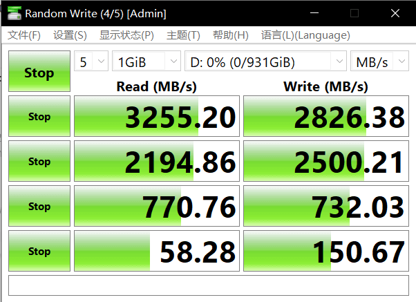

# 三星980设置Encrypted Drive教程 (eDrive, Bitlocker硬件加密)

### 目标

使Bitlocker能用上硬件加密达到无损性能, 通常不使用硬件加密SSD指标会直接低于一半以上,访问延迟也会增加

### 注意

1. 三星OEM SSD不支持! OEM SSD 连Samsung Magician 都用不了, 除非能用三星的Magician DC Tookit(数据中心企业版的那个, 自行摸索!)

2. 当然OEM也可能可以用[sedutil](https://github.com/Drive-Trust-Alliance/sedutil)(自行摸索!)

3. 教程只支持M.2, SATA硬盘没那么麻烦, 直接引导u盘就能Secure Erase, 区别就是可能SATA硬盘会进入安全锁定状态(frozen state), 热拔插硬盘数据线(需要Bios中打开对应热拔插功能)或者笔记本进入睡眠模式(合盖)再唤醒(开盖)一次就行了

### 环境

Windows 10 insider 21382

ASUS B550M主板

[Samsung Magician 6.3.0](https://www.samsung.com/semiconductor/minisite/ssd/download/tools/)

### 材料准备

U盘一枚

### 食谱

1. Samsung Magician 打开Encrypted Drive, Secure Erase制作启动u盘
2. 重启进Bios设置Bios密码以及CSM启动选项, 调整启动顺序, 打开"关闭阻止Sid"(block Sid support)
3. 重启进入u盘执行Secure Erase
4. 重启进入系统建分区,格式化,执行BitLocker加密

### 制作过程

1. Samsung Magician --> Encrypted Drive --> 打勾 状态变成Ready to enable(准备启用)

   

2. 插入u盘 --> 进入Secure Erase --> 选择SSD以及U盘 --> 点击开始

   提示: 如报错, 请重试直到成功

   提示: 找不到U盘软件右下角按钮可以刷新

   

3. 重启计算机进入Bios模式

   3.1 启动CSM支持(重要!) 开启后需要重启一次重新进入Bios, 已开启则忽略

   3.2 调整启动顺序列表, U盘调到最前(重要!)

   

   3.3 进入Bios高级设置(F7?) --> 概要 --> 安全性 --> 设置管理员密码和用户密码(重要!)

   3.4 返回进入"高级"选项卡 --> 安全 --> 打开 "关闭阻止Sid" (block Sid support) (重要! 核心步骤)

   3.5 保存设置并重启引导进入U盘(F10)

   

4. 重启后输入刚设置的密码

5. 出现"关闭阻止Sid"(block Sid support)提示, 按F10, 按后系统自动重启并使"关闭阻止Sid"(block Sid support)功能生效一次, 再次重启自动失效

   

6. 输入密码后自动引导进入U盘

7. 按提示操作, 硬盘列表扫描出硬盘, 表示成功, 一切顺利

   

8. 要是出现 找不到硬盘, 请自行返回第3步骤, 没出现请前往下一步

   

9. 成功后拔掉U盘, 重启进入Bios, 清除刚刚的设置的两个密码(可选)

10. 重启进入系统

11. 进入磁盘管理创建分区, 以及挂载磁盘

12. 开始Bitlocker加密

13. 测试

    

​		

14. 一切顺利, 恭喜!

### 题外话

三星980 不支持Rapid功能的替代品

